# Aligning various genera from Tenericutes


[TOC levels=1-3]: # " "
- [Aligning various genera from Tenericutes](#aligning-various-genera-from-tenericutes)
- [Phylum Tenericutes and outgroups](#phylum-tenericutes-and-outgroups)
    - [Download from NCBI assembly](#download-from-ncbi-assembly)
    - [NCBI taxonomy](#ncbi-taxonomy)
    - [Count strains](#count-strains)
- [Collect proteins](#collect-proteins)
    - [`all.pro.fa`](#allprofa)
    - [`all.replace.fa`](#allreplacefa)
    - [`all.info.tsv`](#allinfotsv)
- [Phylogenetics with 40 single-copy genes, *RpoB*, *EF-tu* and RNase_R](#phylogenetics-with-40-single-copy-genes-rpob-ef-tu-and-rnase_r)
    - [Find corresponding proteins by `hmmsearch`](#find-corresponding-proteins-by-hmmsearch)
    - [Create valid marker gene list](#create-valid-marker-gene-list)
    - [Align and concat marker genes to create species tree](#align-and-concat-marker-genes-to-create-species-tree)
    - [Tweak the concat tree](#tweak-the-concat-tree)
    - [TIGR](#tigr)
- [Bacteria degradosome](#bacteria-degradosome)
    - [Components of the RNA degradosome in E. coli](#components-of-the-rna-degradosome-in-e-coli)
    - [The Gram-Positive Bacterial RNA Degradosome](#the-gram-positive-bacterial-rna-degradosome)
    - [Proteins containing S1 domain in E. coli](#proteins-containing-s1-domain-in-e-coli)
    - [Other RNases](#other-rnases)
- [Intriguing domains](#intriguing-domains)
    - [Domain organisation of RNase R](#domain-organisation-of-rnase-r)
        - [E. coli RNase R](#e-coli-rnase-r)
        - [E. coli RNase II](#e-coli-rnase-ii)
        - [Human RRP44](#human-rrp44)
        - [Fly Dis3](#fly-dis3)
        - [Yeast RRP44](#yeast-rrp44)
        - [Arabidopsis thaliana RP44A](#arabidopsis-thaliana-rp44a)
    - [hmmer.org HMMSCAN Results](#hmmerorg-hmmscan-results)
    - [RNase R domains](#rnase-r-domains)
    - [Scan every domains](#scan-every-domains)
    - [InterProScan](#interproscan)
- [RNase R](#rnase-r)
    - [Stats of annotations and HMM models](#stats-of-annotations-and-hmm-models)
    - [Find all RNase R](#find-all-rnase-r)
    - [Tweak the tree of RNaseR](#tweak-the-tree-of-rnaser)
    - [RNB domain](#rnb-domain)
    - [Importin_rep domain](#importin_rep-domain)
- [Tenericutes: run](#tenericutes-run)


# Phylum Tenericutes and outgroups

无壁菌门, 或称柔膜菌门, 无细胞壁

Ref.:

1. Skennerton, C. T. et al. Phylogenomic analysis of Candidatus Izimaplasma species: free-living
   representatives from a Tenericutes clade found in methane seeps. ISME J. 10, 2679-2692 (2016).

2. Davis, J. J., Xia, F., Overbeek, R. A. & Olsen, G. J. Genomes of the class Erysipelotrichia
   clarify the firmicute origin of the class Mollicutes. Int. J. Syst. Evol. Microbiol. 63,
   2727-2741 (2013).

Key genera:

* Acholeplasmatales
    * *Acholeplasma*: 2147
    * *Candidatus Phytoplasma*: 33926

* Anaeroplasmatales
    * *Anaeroplasma*: 2086
    * *Asteroleplasma*: 2152

* Entomoplasmatales
    * *Entomoplasma*: 46238
    * *Mesoplasma*: 46239
    * *Spiroplasma*: 2132

* Mycoplasmatales
    * *Mycoplasma*: 2093
    * *Ureaplasma*: 2129
    * *Candidatus Hepatoplasma*: 295595

* *Candidatus Izimaplasma*: 1912503

* Haloplasmatales
    * *Haloplasma*: 471824
    * *Inordinaticella*: 1979191

Outgroup:

* Firmicutes
    * Bacillus subtilis subsp. subtilis str. 168: 224308
    * Staphylococcus aureus subsp. aureus NCTC 8325: 93061
    * Eubacterium limosum KIST612: 903814
    * Erysipelothrix rhusiopathiae str. Fujisawa: 650150
    * Clostridium acetobutylicum ATCC 824: 272562
    * Clostridium tetani E88: 212717

* Actinobacteria
    * Amycolatopsis mediterranei U32: 749927
    * Bifidobacterium adolescentis ATCC 15703: 367928
    * Corynebacterium glutamicum ATCC 13032: 196627
    * Mycobacterium tuberculosis H37Rv: 83332

* Alphaproteobacteria
    * Brucella melitensis bv. 1 str. 16M: 224914

* Betaproteobacteria
    * Neisseria gonorrhoeae FA 1090: 242231

* Gammaproteobacteria
    * Escherichia coli str. K-12 substr. MG1655: 511145
    * Salmonella enterica subsp. enterica serovar Typhimurium str. LT2: 99287
    * Pseudomonas aeruginosa PAO1: 208964
    * Pseudomonas putida KT2440: 160488

* delta/epsilon subdivisions
    * Helicobacter pylori 26695: 85962

Check NCBI pages:

* http://www.ncbi.nlm.nih.gov/assembly/?term=txid2093%5BOrganism:exp%5D
* http://www.ncbi.nlm.nih.gov/genome/?term=txid2093%5BOrganism:exp%5D

## Download from NCBI assembly

```bash
export RANK_NAME=Tenericutes

mkdir -p ~/data/alignment/${RANK_NAME}        # Working directory
cd ~/data/alignment/${RANK_NAME}

mysql -ualignDB -palignDB ar_refseq -e "
    SELECT 
        organism_name, species, genus, ftp_path, assembly_level
    FROM ar 
    WHERE 1=1
        AND genus_id in (2147, 33926, 2086, 2152, 46238, 46239, 2132, 2093, 2129, 295595, 1912503, 471824, 1979191)
    " \
    > raw.tsv

mysql -ualignDB -palignDB ar_refseq -e "
    SELECT 
        organism_name, species, genus, ftp_path, assembly_level
    FROM ar 
    WHERE 1=1
        AND taxonomy_id in (224308, 93061, 903814, 650150, 272562, 212717, 749927, 367928, 196627, 83332)
    " \
    >> raw.tsv

mysql -ualignDB -palignDB ar_refseq -e "
    SELECT 
        organism_name, species, genus, ftp_path, assembly_level
    FROM ar 
    WHERE 1=1
        AND taxonomy_id in (224914, 242231, 511145, 99287, 208964, 160488, 85962)
    " \
    >> raw.tsv

mysql -ualignDB -palignDB ar_genbank -e "
    SELECT 
        organism_name, species, genus, ftp_path, assembly_level
    FROM ar 
    WHERE 1=1
        AND genus_id in (2147, 33926, 2086, 2152, 46238, 46239, 2132, 2093, 2129, 295595, 1912503, 471824, 1979191)
    " \
    >> raw.tsv

cat raw.tsv |
    grep -v '^#' |
    perl ~/Scripts/withncbi/taxon/abbr_name.pl -c "1,2,3" -s '\t' -m 3 --shortsub |
    (echo -e '#name\tftp_path\torganism\tassembly_level' && cat ) |
    perl -nl -a -F"," -e '
        BEGIN{my %seen}; 
        /^#/ and print and next;
        /^organism_name/i and next;
        $seen{$F[5]}++;
        $seen{$F[5]} > 1 and next;
        printf qq{%s\t%s\t%s\t%s\n}, $F[5], $F[3], $F[1], $F[4];
        ' |
    keep-header -- sort -k3,3 -k1,1 \
    > ${RANK_NAME}.assembly.tsv

# comment out unneeded assembly levels

# find potential duplicated strains or assemblies
cat ${RANK_NAME}.assembly.tsv |
    cut -f 1 |
    sort |
    uniq -c |
    sort -nr

# Edit .tsv, remove unnecessary strains, check strain names and comment out poor assemblies.
# vim ${GENUS}.assembly.tsv

# Cleaning
rm raw*.*sv

unset RANK_NAME

```

```bash
cd ~/data/alignment/Tenericutes

perl ~/Scripts/withncbi/taxon/assembly_prep.pl \
    -f ~/Scripts/withncbi/pop/Tenericutes.assembly.tsv \
    -o ASSEMBLY

bash ASSEMBLY/Tenericutes.assembly.rsync.sh

bash ASSEMBLY/Tenericutes.assembly.collect.sh

```

## NCBI taxonomy

```bash
cd ~/data/alignment/Tenericutes

bp_taxonomy2tree.pl -e \
    -s "Acholeplasma" \
    -s "Anaeroplasma" \
    -s "Asteroleplasma" \
    -s "Entomoplasma" \
    -s "Haloplasma" \
    -s "Hepatoplasma" \
    -s "Inordinaticella" \
    -s "Izimaplasma" \
    -s "Mesoplasma" \
    -s "Mycoplasma" \
    -s "Phytoplasma" \
    -s "Spiroplasma" \
    -s "Ureaplasma" \
    -s "Bacillus subtilis" \
    -s "Staphylococcus aureus" \
    -s "Eubacterium limosum" \
    -s "Erysipelothrix rhusiopathiae" \
    -s "Clostridium acetobutylicum" \
    -s "Clostridium tetani" \
    -s "Amycolatopsis mediterranei" \
    -s "Bifidobacterium adolescentis" \
    -s "Corynebacterium glutamicum" \
    -s "Mycobacterium tuberculosis" \
    -s "Brucella melitensis" \
    -s "Neisseria gonorrhoeae" \
    -s "Escherichia coli" \
    -s "Salmonella enterica" \
    -s "Pseudomonas aeruginosa" \
    -s "Pseudomonas putida" \
    -s "Helicobacter pylori" \
    > Tenericutes.newick

nw_display -w 600 -s Tenericutes.newick |
    rsvg-convert -o ~/Scripts/withncbi/image/Tenericutes.png

```


## Count strains

```bash
cd ~/data/alignment/Tenericutes

parallel --no-run-if-empty --linebuffer -k -j 4 '
    n_species=$(cat ASSEMBLY/Tenericutes.assembly.collect.csv |
        cut -d"," -f 2 |
        grep -v "Candidatus" |
        grep "{}" |
        cut -d" " -f 1,2 |
        sort |
        uniq |
        wc -l)
    
    n_strains=$(cat ASSEMBLY/Tenericutes.assembly.collect.csv |
        cut -d"," -f 2 |
        grep -v "Candidatus" |
        grep "{}" |
        cut -d" " -f 1,2 |
        sort |
        wc -l)
    
    printf "%s\t%d\t%d\n" {} ${n_species} ${n_strains}
    ' ::: Acholeplasma Entomoplasma Mesoplasma Spiroplasma Mycoplasma Ureaplasma

#Acholeplasma    11      12
#Entomoplasma    6       10
#Mesoplasma      11      15
#Spiroplasma     25      30
#Mycoplasma      86      197
#Ureaplasma      4       25

mkdir -p taxon

echo "An_bac" > taxon/Anaeroplasma
echo "Ha_cont_SSD_17B" > taxon/Haloplasma
echo "I_for" > taxon/Inordinaticella
echo "CH_crin_Av" > taxon/Hepatoplasma

cat <<EOF > taxon/Izimaplasma
CI_sp_HR1
CI_sp_HR2
CI_sp_Z
EOF

cat <<EOF > taxon/Phytoplasma
CP_Ast_AYWB
CP_Bra
CP_aura
CP_aus
CP_aus_Strawberry_NZSb11
CP_mali
CP_ory
CP_phoenici
CP_pru
CP_sol
CP_ziz
CP_Chrysanthemum_c
CP_Chrysanthemum_y
CP_Ech
CP_Ita_MA1
CP_Mai
CP_Mil_MW1
CP_Vac_VAC
CP_Whe
CP_New
CP_Oni_OY_M
CP_Pea_NTU2011
CP_Phy
CP_Poi_JR1
CP_Ric
EOF

parallel --no-run-if-empty --linebuffer -k -j 4 '
    cat ASSEMBLY/Tenericutes.assembly.collect.csv |
        cut -d"," -f 1,2 |
        grep "{}" |
        cut -d"," -f 1 \
        > taxon/{}
    ' ::: Acholeplasma Entomoplasma Mesoplasma Spiroplasma Mycoplasma Ureaplasma

# Misplaced in taxonomy tree
#echo "Ac_sp_CAG_878" >> taxon/Acholeplasma

#cat <<EOF >> taxon/Mycoplasma
#Mycop_sp_CAG_472
#Mycop_sp_CAG_611
#Mycop_sp_CAG_611_25_7
#Mycop_sp_CAG_776
#Mycop_sp_CAG_877
#Mycop_sp_CAG_956
#EOF

cat <<EOF > taxon/Firmicutes
Ba_subt_subtilis_168
St_aure_aureus_NCTC_8325
Cl_ace_ATCC_824
Cl_tet_E88
Er_rhu_Fujisawa
Eu_lim_KIST612
EOF

cat <<EOF > taxon/Actinobacteria
Am_med_U32
Bi_ado_ATCC_15703
Co_glu_ATCC_13032
Mycob_tub_H37Rv
EOF

cat <<EOF > taxon/Proteobacteria
Es_coli_K_12_MG1655
Sa_ente_Typhimurium_LT2
P_aer_PAO1
P_puti_KT2440
Br_meli_bv_1_16M
N_gon_FA_1090
He_pyl_26695
EOF

wc -l taxon/*

find taxon -maxdepth 1 -type f -not -name "*.replace.tsv" |
    xargs -i basename {} \
    > genus.list

# Omit strains without protein annotations
#Sp_Chol
#CP_Phy
#Mycop_moa_ATCC_27625
#Mycop_sp_Bg1
#Mycop_sp_Bg2
#Mycop_sp_U
for GENUS in $(cat genus.list); do
    for STRAIN in $(cat taxon/${GENUS}); do
        if ! compgen -G "ASSEMBLY/${STRAIN}/*_protein.faa.gz" > /dev/null; then
            echo ${STRAIN}
        fi
    done 
done \
    > omit.list

for GENUS in $(cat genus.list); do
    perl -nl -i -MPath::Tiny -e '
        BEGIN { 
            our %omit = map { $_ => 1 }
                        grep {/\S/}
                        path(q{omit.list})->lines({ chomp => 1});
        }
        print $_ if ! exists $omit{$_};
    ' taxon/${GENUS}
done

```

| Order             | Genus           | Comments           | Species | Strains |
|:------------------|:----------------|:-------------------|--------:|--------:|
| Acholeplasmatales |                 |                    |         |         |
|                   | Acholeplasma    | 无胆甾原体           |      11 |      13 |
|                   | Phytoplasma     | 植原体              |         |      25 |
| Anaeroplasmatales |                 |                    |         |         |
|                   | Anaeroplasma    |                    |       1 |       1 |
|                   | Asteroleplasma  |                    |         |         |
| Entomoplasmatales |                 | 虫原体              |         |         |
|                   | Entomoplasma    |                    |       6 |      10 |
|                   | Mesoplasma      |                    |      11 |      15 |
|                   | Spiroplasma     | 螺原体, 感染昆虫与植物 |      25 |      31 |
| Mycoplasmatales   |                 |                    |         |         |
|                   | Mycoplasma      | 支原体              |      86 |     207 |
|                   | Ureaplasma      | 脲原体              |       4 |      25 |
|                   | Hepatoplasma    |                    |       1 |       1 |
| Unclassified      |                 |                    |         |         |
|                   | Izimaplasma     | 独立生活             |         |       3 |
| Haloplasmatales   |                 |                    |         |         |
|                   | Haloplasma      |                    |       1 |       1 |
|                   | Inordinaticella |                    |       1 |       1 |

# Collect proteins

## `all.pro.fa`

```bash
cd ~/data/alignment/Tenericutes

mkdir -p PROTEINS

# 350
find ASSEMBLY -maxdepth 1 -type d |
    sort |
    grep 'ASSEMBLY/' |
    wc -l

# 344
find ASSEMBLY -type f -name "*_protein.faa.gz" |
    wc -l

for GENUS in $(cat genus.list); do
    echo "==> GENUS [${GENUS}]"

    for STRAIN in $(cat taxon/${GENUS}); do
        gzip -dcf ASSEMBLY/${STRAIN}/*_protein.faa.gz
    done
done \
    > PROTEINS/all.pro.fa

# ribonuclease
cat PROTEINS/all.pro.fa |
    grep "ribonuclease" |
    grep -v "deoxyribonuclease" |
    perl -nl -e 's/^>\w+\.\d+\s+//g; print' |
    perl -nl -e 's/\s+\[.+?\]$//g; print' |
    perl -nl -e 's/MULTISPECIES: //g; print' |
    sort |
    uniq -c |
    sort -nr

# methyltransferase
cat PROTEINS/all.pro.fa |
    grep "methyltransferase" |
    perl -nl -e 's/^>\w+\.\d+\s+//g; print' |
    perl -nl -e 's/\s+\[.+?\]$//g; print' |
    perl -nl -e 's/MULTISPECIES: //g; print' |
    sort |
    uniq -c |
    sort -nr

```

## `all.replace.fa`

```bash
cd ~/data/alignment/Tenericutes

rm PROTEINS/all.strain.tsv
for GENUS in $(cat genus.list); do
    echo 1>&2 "==> GENUS [${GENUS}]"

    for STRAIN in $(cat taxon/${GENUS}); do
        gzip -dcf ASSEMBLY/${STRAIN}/*_protein.faa.gz |
            grep "^>" |
            cut -d" " -f 1 |
            sed "s/^>//" |
            STRAIN=${STRAIN} perl -nl -e '
                $n = $_;
                $s = $n;
                $s =~ s/\.\d+//;
                printf qq{%s\t%s_%s\t%s\n}, $n, $ENV{STRAIN}, $s, $ENV{STRAIN};
            ' \
        > PROTEINS/${STRAIN}.replace.tsv
        
        cut -f 2,3 PROTEINS/${STRAIN}.replace.tsv >> PROTEINS/all.strain.tsv

        faops replace -s ASSEMBLY/${STRAIN}/*_protein.faa.gz <(cut -f 1,2 PROTEINS/${STRAIN}.replace.tsv) stdout
        
        rm PROTEINS/${STRAIN}.replace.tsv
    done
done \
    > PROTEINS/all.replace.fa

# counting proteins
cat PROTEINS/all.pro.fa |
    grep "^>" |
    wc -l
#310265

cat PROTEINS/all.replace.fa |
    grep "^>" |
    wc -l
#310265

(echo -e "#name\tstrain" && cat PROTEINS/all.strain.tsv)  \
    > temp && mv temp PROTEINS/all.strain.tsv

faops size PROTEINS/all.replace.fa > PROTEINS/all.replace.sizes

(echo -e "#name\tsize" && cat PROTEINS/all.replace.sizes) > PROTEINS/all.size.tsv

rm PROTEINS/all.replace.sizes

```

## `all.info.tsv`

```bash
cd ~/data/alignment/Tenericutes

for GENUS in $(cat genus.list); do
    echo 1>&2 "==> GENUS [${GENUS}]"

    for STRAIN in $(cat taxon/${GENUS}); do
        gzip -dcf ASSEMBLY/${STRAIN}/*_protein.faa.gz |
            grep "^>" |
            sed "s/^>//" |
            perl -nl -e '/\[.+\[/ and s/\[/\(/; print' |
            perl -nl -e '/\].+\]/ and s/\]/\)/; print' |
            perl -nl -e 's/\s+\[.+?\]$//g; print' |
            perl -nl -e 's/MULTISPECIES: //g; print' |
            STRAIN=${STRAIN} perl -nl -e '
                /^(\w+)\.\d+\s+(.+)$/ or next;
                printf qq{%s_%s\t%s\n}, $ENV{STRAIN}, $1, $2;
            '
    done
done \
    > PROTEINS/all.annotation.tsv

cat PROTEINS/all.annotation.tsv |
    wc -l
#310265

(echo -e "#name\tannotation" && cat PROTEINS/all.annotation.tsv) \
    > temp && mv temp PROTEINS/all.annotation.tsv

# check differences
cat PROTEINS/all.size.tsv |
    grep -F -f <(cut -f 1 PROTEINS/all.annotation.tsv) -v

tsv-join \
    PROTEINS/all.strain.tsv \
    --data-fields 1 \
    -f PROTEINS/all.size.tsv \
    --key-fields 1 \
    --append-fields 2 \
    > PROTEINS/all.strain_size.tsv

tsv-join \
    PROTEINS/all.strain_size.tsv \
    --data-fields 1 \
    -f PROTEINS/all.annotation.tsv \
    --key-fields 1 \
    --append-fields 2 \
    > PROTEINS/all.info.tsv

cat PROTEINS/all.info.tsv |
    wc -l
#310266

```

# Phylogenetics with 40 single-copy genes, *RpoB*, *EF-tu* and RNase_R

##  Find corresponding proteins by `hmmsearch`

* Download need hmm models in [`hmm/README.md`](../hmm/README.md)

* The `E_VALUE` was manually adjusted to 1e-20 to reach a balance between sensitivity and
  speciality.

* RpoB: TIGR02013
* EF-tu: TIGR00485

```bash
E_VALUE=1e-20

cd ~/data/alignment/Tenericutes

# example
#gzip -dcf ASSEMBLY/Aaxa_ATCC_25176/*_protein.faa.gz |
#    hmmsearch -E 1e-20 --domE 1e-20 --noali --notextw ~/data/HMM/40sg/bacteria_and_archaea_dir/BA00001.hmm - |
#    grep '>>' |
#    perl -nl -e '/>>\s+(\S+)/ and print $1'

# Find all genes
for marker in BA000{01..40}; do
    echo "==> marker [${marker}]"
    
    mkdir -p PROTEINS/${marker}
    
    for GENUS in $(cat genus.list); do
        echo "==> GENUS [${GENUS}]"

        for STRAIN in $(cat taxon/${GENUS}); do
            gzip -dcf ASSEMBLY/${STRAIN}/*_protein.faa.gz |
                hmmsearch -E ${E_VALUE} --domE ${E_VALUE} --noali --notextw ~/data/HMM/40scg/bacteria_and_archaea_dir/${marker}.hmm - |
                grep '>>' |
                STRAIN=${STRAIN} perl -nl -e '
                    />>\s+(\S+)/ and printf qq{%s\t%s\n}, $1, $ENV{STRAIN};
                '
        done \
            > PROTEINS/${marker}/${GENUS}.replace.tsv
    done
    
    echo
done

for marker in TIGR02013 TIGR00485; do
    echo "==> marker [${marker}]"
    
    mkdir -p PROTEINS/${marker}
    
    for GENUS in $(cat genus.list); do
        echo "==> GENUS [${GENUS}]"

        for STRAIN in $(cat taxon/${GENUS}); do
            gzip -dcf ASSEMBLY/${STRAIN}/*_protein.faa.gz |
                hmmsearch -E ${E_VALUE} --domE ${E_VALUE} --noali --notextw ~/data/HMM/TIGRFAM/HMM/${marker}.HMM - |
                grep '>>' |
                STRAIN=${STRAIN} perl -nl -e '
                    />>\s+(\S+)/ or next;
                    $n = $1;
                    $s = $n;
                    $s =~ s/\.\d+//;
                    printf qq{%s\t%s_%s\n}, $n, $ENV{STRAIN}, $s;
                '
        done \
            > PROTEINS/${marker}/${GENUS}.replace.tsv
    done
    
    echo
done

```

## Create valid marker gene list

* `hmmsearch` may identify more than one copy for some marker genes.

    * BA00005: translation initiation factor IF-2
    * BA00008: signal recognition particle protein
    * BA00013: phenylalanine--tRNA ligase subunit beta

* Misidentified marker genes

    * BA00004: translation initiation factor EF-2

* Missing from many strains

    * BA00022: ribosomal protein L25/L23
    * BA00027: ribosomal protein L29
    * BA00032: tRNA pseudouridine synthase B
    * BA00035: Porphobilinogen deaminase
    * BA00038: phosphoribosylformylglycinamidine cyclo-ligase
    * BA00039: ribonuclease HII
    * BA00040: ribosomal protein L24

Compare proteins and strains.

```bash
cd ~/data/alignment/Tenericutes

for marker in BA000{01..03} BA000{06..07} BA000{09..12} BA000{14..21} BA000{23..26} BA000{28..31} BA000{33..34} BA000{36..37}; do
    echo ${marker}
done > marker.list

for marker in $(cat marker.list); do
    echo "==> marker [${marker}]"

    for GENUS in $(cat genus.list); do
        cat PROTEINS/${marker}/${GENUS}.replace.tsv |
            cut -f 2 |
            diff - taxon/${GENUS}
    done
    
    echo
done

```

## Align and concat marker genes to create species tree

```bash
cd ~/data/alignment/Tenericutes

# extract sequences 
for marker in $(cat marker.list) TIGR02013 TIGR00485; do
    echo "==> marker [${marker}]"

    for GENUS in $(cat genus.list); do
        echo "==> GENUS [${GENUS}]"

        mytmpdir=`mktemp -d 2>/dev/null || mktemp -d -t 'mytmpdir'`

        # avoid duplicated fasta headers
        faops some PROTEINS/all.pro.fa PROTEINS/${marker}/${GENUS}.replace.tsv stdout |
            faops filter -u stdin ${mytmpdir}/${GENUS}.fa
        
        # avoid duplicated original names
        cat PROTEINS/${marker}/${GENUS}.replace.tsv |
            parallel --no-run-if-empty --linebuffer -k -j 1 "
                faops replace -s ${mytmpdir}/${GENUS}.fa <(echo {}) stdout
            " \
            > PROTEINS/${marker}/${GENUS}.pro.fa
            
        rm -fr ${mytmpdir}
    done
    
    echo
done

for marker in $(cat marker.list) TIGR02013 TIGR00485; do
    echo "==> marker [${marker}]"
    
    for GENUS in $(cat genus.list); do
        cat PROTEINS/${marker}/${GENUS}.pro.fa
    done \
        > PROTEINS/${marker}/${marker}.pro.fa
done

# aligning each markers with muscle
cat marker.list |
    parallel --no-run-if-empty --linebuffer -k -j 4 "
        echo '==> {}'
        
        muscle -quiet -in PROTEINS/{}/{}.pro.fa -out PROTEINS/{}/{}.aln.fa
    "

# concat marker genes
for marker in $(cat marker.list); do
    # sequences in one line
    faops filter -l 0 PROTEINS/${marker}/${marker}.aln.fa stdout
    
    # empty line for .fas
    echo
done \
    > PROTEINS/markers.aln.fas

# faspos names need full headers
#fasops names Phylo/markers.aln.fas -o stdout
cat PROTEINS/markers.aln.fas |
    grep "^>" |
    sed "s/^>//" |
    sort |
    uniq \
    > strains.list
fasops concat PROTEINS/markers.aln.fas strains.list -o PROTEINS/concat.aln.fa

FastTree -quiet PROTEINS/concat.aln.fa > PROTEINS/concat.aln.newick

```

## Tweak the concat tree

```bash
cd ~/data/alignment/Tenericutes

# reroot
nw_reroot PROTEINS/concat.aln.newick Am_med_U32 Es_coli_K_12_MG1655 > PROTEINS/concat.reroot.newick

# Check monophyly for genus
rm genus.monophyly.list genus.paraphyly.list genus.monophyly.map
for GENUS in $(cat genus.list); do
    NODE=$(
        nw_clade -m PROTEINS/concat.reroot.newick $(cat taxon/${GENUS}) |
            nw_stats -f l - |
            cut -f 3
    )
    
    if [[ "$NODE" ]]; then
        echo "${GENUS}" >> genus.monophyly.list
        cat taxon/${GENUS} |
            xargs -I{} echo "{} ${GENUS}___${NODE}" \
            >> genus.monophyly.map
    else
        echo "${GENUS}" >> genus.paraphyly.list
    fi
    
done

# Merge strains in genus to higher-rank
nw_rename PROTEINS/concat.reroot.newick genus.monophyly.map |
    nw_condense - \
    > PROTEINS/concat.map.newick

# strains in species
for GENUS in $(cat genus.paraphyly.list); do
    cat taxon/${GENUS}
done |
    perl -nl -e '/([[:alpha:]]+_[[:alpha:]]+)/ and print $1' |
    perl -nl -e '!/_sp$/ and print' |
    sort |
    uniq -d -c |
    perl -nla -e 'print qq{$F[1]\t$F[1]___$F[0]}' \
    > species.count.tsv

for GENUS in $(cat genus.paraphyly.list); do
    cat taxon/${GENUS}
done \
    > strains.paraphyly.list

# Check monophyly for species
rm species.monophyly.list species.paraphyly.list species.monophyly.map
cat species.count.tsv |
    perl -nl -MPath::Tiny -e '
        BEGIN {
            our @strains = 
                grep {/\S/}
                path(q{strains.paraphyly.list})->lines({ chomp => 1});
        }
        
        my @ns = split /\t/;
        my @sts = grep {/^$ns[0]/} @strains;
        
        my $cmd = q{nw_clade -m PROTEINS/concat.reroot.newick };
        $cmd .= " $_ " for @sts;
        $cmd .= " | nw_stats -f l - | cut -f 3";
        
        my $result = `$cmd`;
        if ($result) {
            print qq{$_ $ns[1]} for @sts;
            path(q{species.monophyly.list})->append($ns[0]);
        }
        else {
            path(q{species.paraphyly.list})->append($ns[0]);
        }
    ' \
    > species.monophyly.map

# Merge strains in species to higher-rank
nw_rename PROTEINS/concat.map.newick species.monophyly.map |
    nw_condense - \
    > PROTEINS/concat.map2.newick

```

## TIGR

```bash
cd ~/data/alignment/Tenericutes

parallel --no-run-if-empty --linebuffer -k -j 4 "
    echo '==> {}'
    
    muscle -quiet -in PROTEINS/{}/{}.pro.fa -out PROTEINS/{}/{}.aln.fa
    
    FastTree -quiet PROTEINS/{}/{}.aln.fa > PROTEINS/{}/{}.aln.newick
    " ::: TIGR02013 TIGR00485

```


# Bacteria degradosome

Ref.:

* Carpousis, A. J. The RNA Degradosome of Escherichia coli: An mRNA-Degrading Machine Assembled on
  RNase E. Annu. Rev. Microbiol. 61, 71-87 (2007).

* Cho, K. H. The Structure and Function of the Gram-Positive Bacterial RNA Degradosome. Front.
  Microbiol. 8, (2017).

## Components of the RNA degradosome in E. coli


https://www.uniprot.org/uniprot/?query=ribonuclease+AND+organism%3A%22Escherichia+coli+%28strain+K12%29+%5B83333%5D%22&sort=score

* RNase E initially inactivates polyribosomal mRNA by cleaving in the translation initiation region
  or in the intercistronic regions of polycistronic messages. As the elongating ribosomes finish
  translating the functionally inactivated mRNA, RNase E further cleaves the ribosome-free mRNA.
* Fragments of mRNA produced by RNase E are digested to nucleotides by the exonucleases.
    * RNase II
    * RNase R
    * PNPase
* RNA helicase B (RhlB) and poly(A) polymerase (PAP) are accessory factors that facilitate
  exoribonucleolytic activity.
    * RhlB
    * PAP

* rne
    * RNE_ECOLI
    * Ribonuclease E
    * https://www.uniprot.org/uniprot/P21513
    * NP_415602
    * S1, RNase_E_G
    * TIGR00757 RNaseEG

* rnb
    * RNB_ECOLI
    * Exoribonuclease 2
    * https://www.uniprot.org/uniprot/P30850
    * NP_415802
    * OB_RNB, CSD2, RNB, S1

* rnr
    * RNR_ECOLI
    * Ribonuclease R
    * https://www.uniprot.org/uniprot/P21499
    * NP_418600
    * HTH_12, OB_RNB, CSD2, RNB, S1

* pnp
    * PNP_ECOLI
    * Polyribonucleotide nucleotidyltransferase
    * https://www.uniprot.org/uniprot/P05055
    * NP_417633
    * RNase_PH, RNase_PH_C, PNPase, RNase_PH, RNase_PH_C, KH_1, S1
    * TIGR03591 polynuc_phos

* rhlB
    * RHLB_ECOLI
    * ATP-dependent RNA helicase RhlB
    * https://www.uniprot.org/uniprot/P0A8J8
    * NP_418227
    * DEAD, Helicase_C

* eno
    * ENO_ECOLI
    * Enolase
    * https://www.uniprot.org/uniprot/P0A6P9
    * NP_417259
    * Enolase_N, Enolase_C
    * TIGR01060 eno

* pcnB
    * PCNB_ECOLI
    * Poly(A) polymerase I
    * https://www.uniprot.org/uniprot/P0ABF1
    * NP_414685
    * PolyA_pol, PolyA_pol_RNAbd, PolyA_pol_arg_C
    * TIGR01942 pcnB

RNE_ECOLI has binary interactions with 5 proteins:

* SRMB_ECOLI
* PNP_ECOLI
* DNAK_ECOLI
* RHLB_ECOLI
* ENO_ECOLI

* srmB
    * SRMB_ECOLI
    * ATP-dependent RNA helicase SrmB
    * https://www.uniprot.org/uniprot/P21507
    * NP_417071
    * DEAD, Helicase_C

* dnaK
    * DNAK_ECOLI
    * Chaperone protein DnaK
    * https://www.uniprot.org/uniprot/P0A6Y8
    * NP_414555
    * HSP70 (PF00012)
    * TIGR02350 prok_dnaK

## The Gram-Positive Bacterial RNA Degradosome

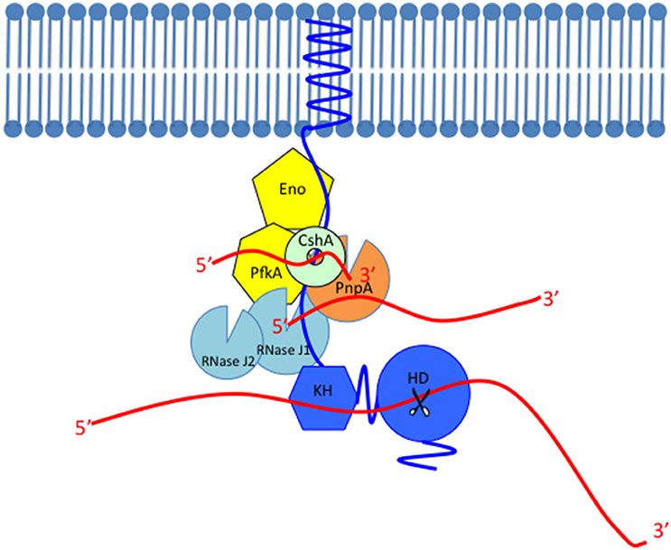

https://www.uniprot.org/uniprot/?query=Ribonuclease+AND+organism%3A%22Bacillus+subtilis+%28strain+168%29+%5B224308%5D%22&sort=score

* RNase E ==> RNase Y, RNase J1 and J2
* PNPase == PNPase
* RhlB ==> CshA
* Enolase ==> Enolase and PFK

* rny
    * RNY_BACSU
    * Ribonuclease Y
    * https://www.uniprot.org/uniprot/O31774
    * DUF3552, KH_1, HD
    * TIGR03319 RNase_Y

* rnjA
    * RNJ1_BACSU
    * Ribonuclease J1
    * https://www.uniprot.org/uniprot/Q45493
    * Lactamase_B, RMMBL, RNase_J_C
    * TIGR00649 MG423

* rnjB
    * RNJ2_BACSU
    * Ribonuclease J2
    * https://www.uniprot.org/uniprot/O31760
    * Lactamase_B, RMMBL, RNase_J_C
    * TIGR00649 MG423

* cshA
    * CSHA_BACSU
    * DEAD-box ATP-dependent RNA helicase CshA
    * https://www.uniprot.org/uniprot/P96614
    * DEAD, Helicase_C

* pfkA
    * PFKA_BACSU
    * ATP-dependent 6-phosphofructokinase
    * https://www.uniprot.org/uniprot/O34529
    * PFK (PF00365)
    * TIGR02482 PFKA_ATP

* pnp
    * PNP_BACSU
    * Polyribonucleotide nucleotidyltransferase
    * https://www.uniprot.org/uniprot/P50849
    * NP_389551
    * RNase_PH, RNase_PH_C, PNPase, RNase_PH, RNase_PH_C, KH_1, S1
    * TIGR03591 polynuc_phos

## Proteins containing S1 domain in E. coli

* rpsA
    * RS1_ECOLI
    * 30S ribosomal protein S1
    * https://www.uniprot.org/uniprot/P0AG67
    * NP_415431
    * 6 X S1
    * TIGR00717 rpsA

* rng
    * RNG_ECOLI
    * Ribonuclease G
    * https://www.uniprot.org/uniprot/P0A9J0
    * NP_417713
    * S1, RNase_E_G
    * TIGR00757 RNaseEG

* nusA
    * NUSA_ECOLI
    * Transcription termination/antitermination protein NusA
    * https://www.uniprot.org/uniprot/P0AFF6
    * NP_417638
    * NusA_N, S1, KH_5, HHH_5
    * TIGR01953 NusA

* yhgF
    * YHGF_ECOLI
    * Protein YhgF
    * https://www.uniprot.org/uniprot/P46837
    * NP_417866
    * Tex_N, Tex_YqgF, HHH_3, HHH_9, S1

## Other RNases

* exo

    * RNase D
    * RNase T
    * RNase PH
    * Oligo RNase

* endo

    * RNase I
    * RNase III
    * RNase P
    * RNase H
    * RNase BN/Z

# Intriguing domains

## Domain organisation of RNase R

### E. coli RNase R

* [Pfam](http://pfam.xfam.org/protein/RNR_ECOLI)
* [UniProt](https://www.uniprot.org/uniprot/P21499)
* [NCBI](https://www.ncbi.nlm.nih.gov/protein/NP_418600.4)


### E. coli RNase II

* [Pfam](http://pfam.xfam.org/protein/RNB_ECOLI)
* [UniProt](https://www.uniprot.org/uniprot/P30850)
* [NCBI](https://www.ncbi.nlm.nih.gov/protein/NP_415802.1)


### Human RRP44

* [Pfam](http://pfam.xfam.org/protein/RRP44_HUMAN)
* [UniProt](https://www.uniprot.org/uniprot/Q9Y2L1)
* [NCBI](https://www.ncbi.nlm.nih.gov/protein/NP_055768.3)
* Subcellular location: Nucleus


### Fly Dis3

* [Pfam](http://pfam.xfam.org/protein/Q9VC93_DROME)
* [UniProt](https://www.uniprot.org/uniprot/Q9VC93)
* Subcellular location: Nucleus


### Yeast RRP44

* [Pfam](http://pfam.xfam.org/protein/RRP44_YEAST)
* [UniProt](https://www.uniprot.org/uniprot/Q08162)
* [NCBI](https://www.ncbi.nlm.nih.gov/protein/NP_014621.1)
* Subcellular location: Nucleus, Mitochondrion


### Arabidopsis thaliana RP44A

* [UniProt](https://www.uniprot.org/uniprot/Q9SHL7)
* Subcellular location: Nucleus


## hmmer.org HMMSCAN Results

|  |
|:--------------------------------------------------------------------:|
|                       Am_med_U32_YP_003763410                        |

| 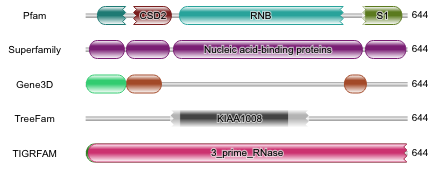 |
|:--------------------------------------------------------------------------------:|
|                          Es_coli_K_12_MG1655_NP_415802                           |

| 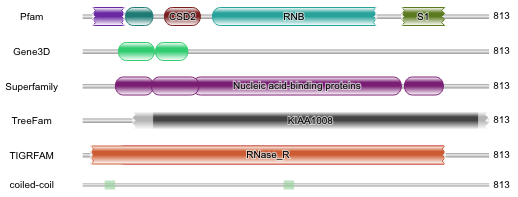 |
|:--------------------------------------------------------------------------------:|
|                          Es_coli_K_12_MG1655_NP_418600                           |

| 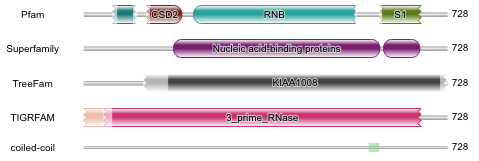 |
|:------------------------------------------------------------------------:|
|                        Ac_lai_PG_8A_WP_012242357                         |

| 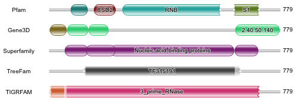 |
|:----------------------------------------------------------------------------------:|
|                           Ba_subt_subtilis_168_NP_391241                           |

| 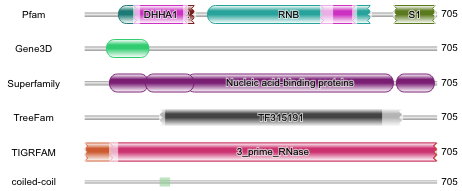 |
|:----------------------------------------------------------------------------:|
|                         Sp_mell_IPMB4A_WP_004029051                          |

| 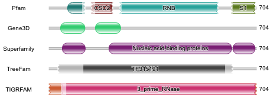 |
|:----------------------------------------------------------------------------------:|
|                           En_lum_ATCC_49195_WP_025734730                           |

| 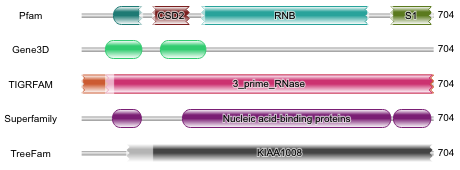 |
|:------------------------------------------------------------------:|
|                       Me_florum_L1_YP_053450                       |

|  |
|:--------------------------------------------------------------------------------------------------------------:|
|                                  Mycop_cap_capricolum_ATCC_27343_WP_011386996                                  |

| 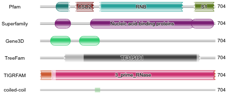 |
|:--------------------------------------------------------------------------:|
|                         Mycop_put_KS1_WP_014034866                         |

|  |
|:--------------------------------------------------------------------:|
|                       Mycop_hyor_WP_014335631                        |

| 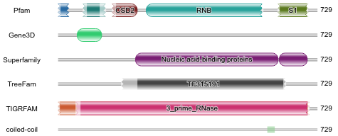 |
|:------------------------------------------------------------------------------------:|
|                           Mycop_bovis_CQ_W70_WP_013456627                            |

|  |
|:----------------------------------------------------------------------------------:|
|                           Mycop_canis_PG_14_WP_004794628                           |

| 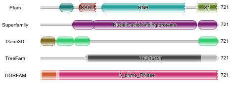 |
|:--------------------------------------------------------------------------------------:|
|                            U_ure_10_ATCC_33699_WP_012560232                            |

| 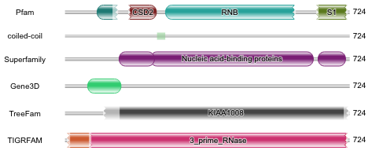 |
|:------------------------------------------------------------------------:|
|                        Mycop_gallis_WP_011113707                         |

|  |
|:------------------------------------------------------------------:|
|                       Mycop_pne_WP_014325416                       |

|  |
|:--------------------------------------------------------------------------:|
|                         Mycop_gen_G37_WP_009885662                         |

## RNase R domains

* OB_RNB (PF08206)
* CSD2 (PF17876)
* RNB (PF00773)
* S1 (PF00575)

* HTH_12 (PF08461)
* RNase_II_C_S1 (PF18614)
* Importin_rep (PF18773)

* PIN_4 (PF13638)
* Rrp44_CSD1 (PF17216)
* OB_Dis3 (PF17849)
* Rrp44_S1 (PF17215)

* RNase_E_G (PF10150)
* RNase_PH (PF01138)
* RNase_PH_C (PF03725)
* PNPase (PF03726)
* KH_1 (PF00013)

* DEAD (PF00270)
* Helicase_C (PF00271)

* PolyA_pol (PF01743)
* PolyA_pol_RNAbd (PF12627)
* PolyA_pol_arg_C (PF12626)

* Enolase_N (PF03952)
* Enolase_C (PF00113)

* DUF3552 (PF12072)
* HD (PF01966)

* Lactamase_B (PF00753)
* RMMBL (PF07521)
* RNase_J_C (PF17770)

* PFK (PF00365)

* RNase_R: TIGR02063
* 3_prime_RNase: TIGR00358

* rpsA: TIGR00717
* RNaseEG: TIGR00757
* polynuc_phos: TIGR03591
* NusA: TIGR01953
* pcnB: TIGR01942
* eno: TIGR01060

* RNase_Y: TIGR03319
* MG423: TIGR00649
* PFKA_ATP: TIGR02482

```bash
cd ~/data/alignment/Tenericutes

mkdir -p DOMAINS/HMM
cd DOMAINS/HMM

for ID in \
    PF08206 PF17876 PF00773 PF00575 \
    PF08461 PF18614 PF18773 \
    PF13638 PF17216 PF17849 PF17215 \
    PF10150 PF01138 PF03725 PF03726 PF00013 \
    PF00270 PF00271 \
    PF01743 PF12627 PF12626 \
    PF03952 PF00113 \
    PF12072 PF01966 \
    PF00753 PF07521 PF17770 \
    PF00365 \
    ; do
    wget -N --content-disposition http://pfam.xfam.org/family/${ID}/hmm
done

cp ~/data/HMM/TIGRFAM/HMM/TIGR02063.HMM RNase_R.hmm
cp ~/data/HMM/TIGRFAM/HMM/TIGR00358.HMM 3_prime_RNase.hmm

cp ~/data/HMM/TIGRFAM/HMM/TIGR00717.HMM rpsA.hmm
cp ~/data/HMM/TIGRFAM/HMM/TIGR00757.HMM RNaseEG.hmm
cp ~/data/HMM/TIGRFAM/HMM/TIGR03591.HMM polynuc_phos.hmm
cp ~/data/HMM/TIGRFAM/HMM/TIGR01953.HMM NusA.hmm
cp ~/data/HMM/TIGRFAM/HMM/TIGR01942.HMM pcnB.hmm
cp ~/data/HMM/TIGRFAM/HMM/TIGR01060.HMM eno.hmm

cp ~/data/HMM/TIGRFAM/HMM/TIGR03319.HMM RNase_Y.hmm
cp ~/data/HMM/TIGRFAM/HMM/TIGR00649.HMM MG423.hmm
cp ~/data/HMM/TIGRFAM/HMM/TIGR02482.HMM PFKA_ATP.hmm

```

## Scan every domains

```bash
E_VALUE=1e-3

cd ~/data/alignment/Tenericutes

for domain in \
    OB_RNB CSD2 RNB S1 \
    HTH_12 RNase_II_C_S1 Importin_rep \
    PIN_4 Rrp44_CSD1 OB_Dis3 Rrp44_S1 \
    RNase_E_G RNase_PH RNase_PH_C PNPase KH_1 \
    DEAD Helicase_C \
    PolyA_pol PolyA_pol_RNAbd PolyA_pol_arg_C \
    Enolase_N Enolase_C \
    DUF3552 HD \
    Lactamase_B RMMBL RNase_J_C \
    PFK \
    RNase_R 3_prime_RNase \
    rpsA RNaseEG polynuc_phos NusA pcnB eno \
    RNase_Y MG423 PFKA_ATP \
    ; do
    echo ${domain}
done \
    > domain.list

for domain in $(cat domain.list); do
    echo 1>&2 "==> domain [${domain}]"
        
    for GENUS in $(cat genus.list); do
        echo 1>&2 "==> GENUS [${GENUS}]"

        for STRAIN in $(cat taxon/${GENUS}); do
            gzip -dcf ASSEMBLY/${STRAIN}/*_protein.faa.gz |
                hmmsearch -E ${E_VALUE} --domE ${E_VALUE} --noali --notextw DOMAINS/HMM/${domain}.hmm - |
                grep '>>' |
                STRAIN=${STRAIN} perl -nl -e '
                    />>\s+(\S+)/ or next;
                    $n = $1;
                    $s = $n;
                    $s =~ s/\.\d+//;
                    printf qq{%s\t%s_%s\n}, $n, $ENV{STRAIN}, $s;
                '
        done 
    done \
        > DOMAINS/${domain}.replace.tsv
    
    echo 1>&2
done

for domain in $(cat domain.list); do
    wc -l DOMAINS/${domain}.replace.tsv
done |
    datamash reverse -W |
    (echo -e "Domain\tCount" && cat) |
    mlr --itsv --omd cat

# All proteins appeared
find DOMAINS/ -name "*.replace.tsv" |
    sort |
    parallel -j 1 'cut -f 2 {}' |
    sort -u \
    > DOMAINS/domains.tsv
wc -l DOMAINS/domains.tsv
#7334 DOMAINS/domains.tsv

# Status of domains
for domain in $(cat domain.list); do
    echo 1>&2 "==> domain [${domain}]"

    tsv-join \
        DOMAINS/domains.tsv \
        --data-fields 1 \
        -f <(
            cat DOMAINS/${domain}.replace.tsv |
                perl -nla -e 'print qq{$F[1]\tO}' 
        ) \
        --key-fields 1 \
        --append-fields 2 \
        --write-all "" \
        > DOMAINS/tmp.tsv
        
    mv DOMAINS/tmp.tsv DOMAINS/domains.tsv
done

datamash check < DOMAINS/domains.tsv
#7334 lines, 41 fields

# Add header line
for domain in $(cat domain.list); do
    echo "${domain}"
done |
    (echo -e "#name" && cat) |
    paste -s -d $'\t' - \
    > DOMAINS/header.tsv

# Filter out DEAD or Helicase_C only sequences
cat DOMAINS/domains.tsv |
    tsv-filter --str-eq 18:O --str-eq 19:O \
    > DOMAINS/RHLB.tsv

cat DOMAINS/domains.tsv |
    tsv-filter --str-ne 18:O --str-ne 19:O |
    (cat DOMAINS/header.tsv && cat) |
    (cat && cat DOMAINS/RHLB.tsv) |
    keep-header -- sort -k1,1 \
    > temp && mv temp DOMAINS/domains.tsv

tsv-join \
    PROTEINS/all.size_anno.tsv \
    --data-fields 1 \
    -f DOMAINS/domains.tsv \
    --key-fields 1 \
    --append-fields 2-41 |
     keep-header -- sort -k1,1 \
    > temp && mv temp DOMAINS/domains.tsv

rm DOMAINS/header.tsv DOMAINS/RHLB.tsv

```

| Domain                              | Count |
|:------------------------------------|:------|
| DOMAINS/OB_RNB.replace.tsv          | 382   |
| DOMAINS/CSD2.replace.tsv            | 279   |
| DOMAINS/RNB.replace.tsv             | 312   |
| DOMAINS/S1.replace.tsv              | 832   |
| DOMAINS/HTH_12.replace.tsv          | 120   |
| DOMAINS/RNase_II_C_S1.replace.tsv   | 96    |
| DOMAINS/Importin_rep.replace.tsv    | 6     |
| DOMAINS/PIN_4.replace.tsv           | 13    |
| DOMAINS/Rrp44_CSD1.replace.tsv      | 5     |
| DOMAINS/OB_Dis3.replace.tsv         | 8     |
| DOMAINS/Rrp44_S1.replace.tsv        | 0     |
| DOMAINS/RNase_E_G.replace.tsv       | 22    |
| DOMAINS/RNase_PH.replace.tsv        | 88    |
| DOMAINS/RNase_PH_C.replace.tsv      | 97    |
| DOMAINS/PNPase.replace.tsv          | 80    |
| DOMAINS/KH_1.replace.tsv            | 470   |
| DOMAINS/DEAD.replace.tsv            | 2276  |
| DOMAINS/Helicase_C.replace.tsv      | 1454  |
| DOMAINS/PolyA_pol.replace.tsv       | 66    |
| DOMAINS/PolyA_pol_RNAbd.replace.tsv | 86    |
| DOMAINS/PolyA_pol_arg_C.replace.tsv | 6     |
| DOMAINS/Enolase_N.replace.tsv       | 335   |
| DOMAINS/Enolase_C.replace.tsv       | 337   |
| DOMAINS/DUF3552.replace.tsv         | 269   |
| DOMAINS/HD.replace.tsv              | 1280  |
| DOMAINS/Lactamase_B.replace.tsv     | 789   |
| DOMAINS/RMMBL.replace.tsv           | 439   |
| DOMAINS/RNase_J_C.replace.tsv       | 569   |
| DOMAINS/PFK.replace.tsv             | 321   |
| DOMAINS/RNase_R.replace.tsv         | 481   |
| DOMAINS/3_prime_RNase.replace.tsv   | 393   |
| DOMAINS/rpsA.replace.tsv            | 600   |
| DOMAINS/RNaseEG.replace.tsv         | 26    |
| DOMAINS/polynuc_phos.replace.tsv    | 598   |
| DOMAINS/NusA.replace.tsv            | 349   |
| DOMAINS/pcnB.replace.tsv            | 67    |
| DOMAINS/eno.replace.tsv             | 338   |
| DOMAINS/RNase_Y.replace.tsv         | 551   |
| DOMAINS/MG423.replace.tsv           | 761   |
| DOMAINS/PFKA_ATP.replace.tsv        | 371   |

# RNase R

## Stats of annotations and HMM models

| Item               | Count |
|:-------------------|------:|
| " ribonuclease R " |   292 |
| " RNB "            |     6 |
| " RNase II "       |     1 |
| " RNase R "        |     2 |
| deduped            |   224 |
| OB_RNB             |   187 |
| CSD2               |   192 |
| RNB                |   219 |
| S1                 |   201 |

```bash
cd ~/data/alignment/Tenericutes

mkdir -p RNaseR

faops some PROTEINS/all.pro.fa \
    <(cat PROTEINS/all.pro.fa |
        grep -e " ribonuclease R " -e " RNB " -e " RNase II " -e " RNase R " |
        cut -d" " -f 1 |
        sed "s/^>//" |
        sort | uniq) \
    stdout |
    faops filter -u stdin stdout \
    > RNaseR/RNaseR.all.fa

cat PROTEINS/all.pro.fa |
    grep " ribonuclease R " |
    wc -l
cat PROTEINS/all.pro.fa |
    grep " RNB " |
    wc -l
cat PROTEINS/all.pro.fa |
    grep " RNase II " |
    wc -l
cat PROTEINS/all.pro.fa |
    grep " RNase R " |
    wc -l

cat RNaseR/RNaseR.all.fa |
    grep "^>" |
    wc -l
for domain in OB_RNB CSD2 RNB S1; do
    cat RNaseR/RNaseR.all.fa |
        grep "^>" |
        sed "s/^>//" |
        grep -Fx -f <(cut -f 1 DOMAINS/${domain}.replace.tsv) |
        wc -l
done

# Strains and RNase R
find ASSEMBLY -maxdepth 1 -type d |
    sort |
    grep 'ASSEMBLY/' |
    parallel --no-run-if-empty --linebuffer -k -j 4 '
        gzip -dcf {}/*_protein.faa.gz |
            grep -e " ribonuclease R " -e " RNB " -e " RNase II " -e " RNase R " |
            (echo {} && cat)
        echo
    ' \
    > RNaseR/strain_anno.txt

# Annotations containing RNB domain
cat PROTEINS/all.pro.fa |
    grep "^>" |
    grep -f <(cut -f 1 DOMAINS/RNB.replace.tsv) |
    perl -nl -e 's/^>\w+\.\d+\s+//g; print' |
    perl -nl -e 's/\s+\[.+?\]$//g; print' |
    perl -nl -e 's/MULTISPECIES: //g; print' |
    sort |
    uniq -c |
    sort -nr

# Annotated as RNase R but lacking RNB domains:
cat PROTEINS/all.pro.fa |
    grep "^>" |
    grep -e " ribonuclease R " -e " RNB " -e " RNase II " -e " RNase R "|
    grep -v -f <(cut -f 1 DOMAINS/RNB.replace.tsv)
#>OAL10424.1 ribonuclease R [Candidatus Mycoplasma haemobos]
#>AFO52271.1 ribonuclease R [Candidatus Mycoplasma haemolamae str. Purdue]
#>AEG72387.1 ribonuclease R [Mycoplasma haemofelis Ohio2]
#>WP_112665413.1 ribonuclease R [Mycoplasma wenyonii]
#>NP_462407.3 putative RNase R [Salmonella enterica subsp. enterica serovar Typhimurium str. LT2]

```

## Find all RNase R

```bash
cd ~/data/alignment/Tenericutes

# Find all genes
for GENUS in $(cat genus.list); do
    echo "==> GENUS [${GENUS}]"

    for STRAIN in $(cat taxon/${GENUS}); do
        gzip -dcf ASSEMBLY/${STRAIN}/*_protein.faa.gz |
            grep -e " ribonuclease R " -e " RNB " -e " RNase II " -e " RNase R "|
            cut -d" " -f 1 |
            sed "s/^>//" |
            STRAIN=${STRAIN} perl -nl -MPath::Tiny -e '
                BEGIN {
                    our %seen = map {(split /\t/)[0] => 1} 
                        grep {/\S/}
                        path(q{DOMAINS/RNB.replace.tsv})->lines({ chomp => 1});
                }
                
                $n = $_;
                $s = $n;
                $s =~ s/\.\d+//;
                if (exists $seen{$n}) {
                    printf qq{%s\t%s_%s\n}, $n, $ENV{STRAIN}, $s;
                }
                else {
                    printf STDERR qq{%s\t%s_%s\n}, $n, $ENV{STRAIN}, $s;
                }
            '
    done \
        > RNaseR/${GENUS}.replace.tsv
done

# 296
cat RNaseR/*.replace.tsv | wc -l

# extract sequences for each genus
for GENUS in $(cat genus.list); do
    echo "==> ${GENUS}"
    
    mytmpdir=`mktemp -d 2>/dev/null || mktemp -d -t 'mytmpdir'`

    # avoid duplicated fasta headers
    faops some PROTEINS/all.pro.fa RNaseR/${GENUS}.replace.tsv stdout |
        faops filter -u stdin ${mytmpdir}/${GENUS}.fa
    
    # avoid duplicated original names
    cat RNaseR/${GENUS}.replace.tsv |
        parallel --no-run-if-empty --linebuffer -k -j 1 "
            faops replace -s ${mytmpdir}/${GENUS}.fa <(echo {}) stdout
        " \
        > RNaseR/${GENUS}.pro.fa
        
    rm -fr ${mytmpdir}
done

# aligning with muscle
cat genus.list |
    parallel --no-run-if-empty --linebuffer -k -j 4 '
        echo "==> {}"
        
        muscle -quiet -in RNaseR/{}.pro.fa -out RNaseR/{}.aln.fa
    '

# newick trees
cat genus.list |
    parallel --no-run-if-empty --linebuffer -k -j 4 '
        echo "==> {}"
        
        FastTree -quiet RNaseR/{}.aln.fa > RNaseR/{}.aln.newick
    '

for GENUS in $(cat genus.list); do
    cat RNaseR/${GENUS}.pro.fa
done \
    > RNaseR/RNaseR.pro.fa

muscle -quiet -in RNaseR/RNaseR.pro.fa -out RNaseR/RNaseR.aln.fa
FastTree -quiet RNaseR/RNaseR.aln.fa > RNaseR/RNaseR.aln.newick

```

## Tweak the tree of RNaseR

```bash
cd ~/data/alignment/Tenericutes

# reroot
nw_reroot RNaseR/RNaseR.aln.newick Am_med_U32_YP_003763410 > RNaseR/RNaseR.reroot.newick

nw_labels -I RNaseR/RNaseR.aln.newick > RNaseR.list

# strains in species
cat RNaseR.list |
    perl -nl -e '/([[:alpha:]]+_[[:alpha:]]+)/ and print $1' |
    perl -nl -e '!/_sp$/ and print' |
    sort |
    uniq -d -c |
    perl -nla -e 'print qq{$F[1]\t$F[1]___$F[0]}' \
    > species.count.tsv

# Check monophyly for species
rm species.monophyly.list species.paraphyly.list species.monophyly.map
cat species.count.tsv |
    perl -nl -MPath::Tiny -e '
        BEGIN {
            our @lists = 
                grep {/\S/}
                path(q{RNaseR.list})->lines({ chomp => 1});
        }
        
        my @ns = split /\t/;
        my @sts = grep {/^$ns[0]/} @lists;
        
        my $cmd = q{nw_clade -m RNaseR/RNaseR.reroot.newick };
        $cmd .= " $_ " for @sts;
        $cmd .= " | nw_stats -f l - | cut -f 3";
        
        my $result = `$cmd`;
        if ($result) {
            print qq{$_ $ns[1]} for @sts;
            path(q{species.monophyly.list})->append($ns[0]);
        }
        else {
            path(q{species.paraphyly.list})->append($ns[0]);
        }
    ' \
    > species.monophyly.map

# Merge strains in species to higher-rank
nw_rename RNaseR/RNaseR.reroot.newick species.monophyly.map |
    nw_condense - \
    > RNaseR/RNaseR.map.newick

```

## RNB domain

```bash
E_VALUE=1e-3

cd ~/data/alignment/Tenericutes

hmmsearch \
    -E ${E_VALUE} --domE ${E_VALUE} \
    -A RNaseR/RNB.sto DOMAINS/HMM/RNB.hmm RNaseR/RNaseR.pro.fa

esl-reformat fasta RNaseR/RNB.sto > RNaseR/RNB.pro.fa

muscle -quiet -in RNaseR/RNB.pro.fa -out RNaseR/RNB.aln.fa
FastTree -quiet RNaseR/RNB.aln.fa > RNaseR/RNB.aln.newick

# reroot
nw_reroot RNaseR/RNB.aln.newick Am_med_U32_YP_003763410/46-352 > RNaseR/RNB.reroot.newick

nw_labels -I RNaseR/RNB.aln.newick > RNB.list

# strains in species
cat RNB.list |
    perl -nl -e '/([[:alpha:]]+_[[:alpha:]]+)/ and print $1' |
    perl -nl -e '!/_sp$/ and print' |
    sort |
    uniq -d -c |
    perl -nla -e 'print qq{$F[1]\t$F[1]___$F[0]}' \
    > species.count.tsv

# Check monophyly for species
rm species.monophyly.list species.paraphyly.list species.monophyly.map
cat species.count.tsv |
    perl -nl -MPath::Tiny -e '
        BEGIN {
            our @lists = 
                grep {/\S/}
                path(q{RNB.list})->lines({ chomp => 1});
        }
        
        my @ns = split /\t/;
        my @sts = grep {/^$ns[0]/} @lists;
        
        my $cmd = q{nw_clade -m RNaseR/RNB.reroot.newick };
        $cmd .= " $_ " for @sts;
        $cmd .= " | nw_stats -f l - | cut -f 3";
        
        my $result = `$cmd`;
        if ($result) {
            print qq{$_ $ns[1]} for @sts;
            path(q{species.monophyly.list})->append($ns[0]);
        }
        else {
            path(q{species.paraphyly.list})->append($ns[0]);
        }
    ' \
    > species.monophyly.map

# Merge strains in species to higher-rank
nw_rename RNaseR/RNB.reroot.newick species.monophyly.map |
    nw_condense - \
    > RNaseR/RNB.map.newick

```


## Importin_rep domain

```bash
E_VALUE=1e-3

cd ~/data/alignment/Tenericutes

hmmsearch \
    -E ${E_VALUE} --domE ${E_VALUE} \
    -A RNaseR/Importin_rep.sto DOMAINS/HMM/Importin_rep.hmm RNaseR/RNaseR.pro.fa

esl-reformat fasta RNaseR/Importin_rep.sto > RNaseR/Importin_rep.pro.fa

muscle -quiet -in RNaseR/Importin_rep.pro.fa -out RNaseR/Importin_rep.aln.fa
FastTree -quiet RNaseR/Importin_rep.aln.fa > RNaseR/Importin_rep.aln.newick

```

# Tenericutes: run

```bash
$(brew --prefix)/Cellar/$(brew list --versions repeatmasker | sed 's/ /\//')/libexec/util/queryRepeatDatabase.pl \
    -stat -species Bacteria
```

* Rsync to hpcc

```bash
rsync -avP \
    ~/data/alignment/Tenericutes/ \
    wangq@202.119.37.251:data/alignment/Tenericutes

# rsync -avP wangq@202.119.37.251:data/alignment/Tenericutes/ ~/data/alignment/Tenericutes

```

`--perseq` for RefSeq_category Reference Genome assemblies.

```bash
cd ~/data/alignment/Tenericutes

# prep
egaz template \
    ASSEMBLY \
    --prep -o GENOMES \
    --perseq Mpne_M129 \
    --perseq Mflo_L1 \
    --perseq Mmyc_subsp_mycoides_SC_str_PG1 \
    --min 5000 --about 5000000 \
    -v --repeatmasker "--parallel 24"

bsub -q mpi -n 24 -J "T-0_prep" "bash GENOMES/0_prep.sh"

ls -t output.* | head -n 1 | xargs tail -f | grep "==>"

# gff
for n in Mpne_M129 Mflo_L1 Mmyc_subsp_mycoides_SC_str_PG1; do
    FILE_GFF=$(find ASSEMBLY -type f -name "*_genomic.gff.gz" | grep "${n}")
    echo >&2 "==> Processing ${n}/${FILE_GFF}"
    
    gzip -dcf ${FILE_GFF} > GENOMES/${n}/chr.gff
done

# multi
egaz template \
    GENOMES/Mpne_M129 \
    $(find GENOMES -maxdepth 1 -type d -path "*/????*" | grep -v "Mpne_M129") \
    --multi -o multi/ \
    --rawphylo --parallel 24 -v

bsub -q mpi -n 24 -J "T-1_pair" "bash multi/1_pair.sh"
bsub -w "ended(T-1_pair)" \
    -q mpi -n 24 -J "T-2_rawphylo" "bash multi/2_rawphylo.sh"
bsub  -w "ended(T-2_rawphylo)" \
    -q mpi -n 24 -J "T-3_multi" "bash multi/3_multi.sh"

# multi_Pfal
egaz template \
    GENOMES/Pfal_3D7 \
    $(find GENOMES -maxdepth 1 -type d -path "*/????*" | grep "Pfal_" | grep -v "Pfal_3D7") \
    GENOMES/Prei_SY57 \
    --multi -o multi/ \
    --multiname multi_Pfal --tree multi/Results/multi.nwk --outgroup Prei_SY57 \
    --parallel 24 -v

bsub -q mpi -n 24 -J "T-3_multi" "bash multi/3_multi.sh"

# self
egaz template \
    GENOMES/Pfal_3D7 GENOMES/Pber_ANKA GENOMES/Pcha_chabaudi \
    GENOMES/Pcyn_strain_B GENOMES/Pkno_strain_H \
    --self -o self/ \
    --circos --parallel 24 -v

bsub -q mpi -n 24 -J "T-1_self" "bash self/1_self.sh"
bsub -w "ended(T-1_self)" \
    -q mpi -n 24 -J "T-3_proc" "bash self/3_proc.sh"
bsub  -w "ended(T-3_proc)" \
    -q mpi -n 24 -J "T-4_circos" "bash self/4_circos.sh"

```

